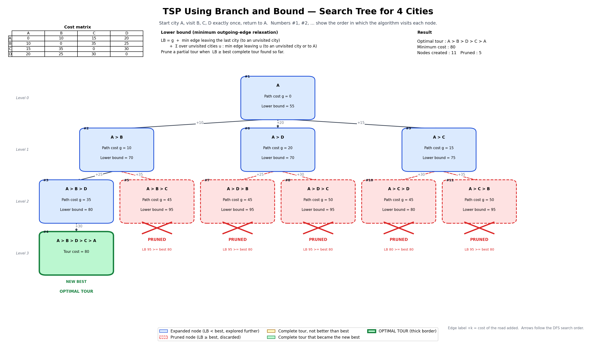

# Project 14 — TSP Branch-and-Bound Search Tree

**Course:** Design and Analysis of Algorithms (DAA) — Macro Project  **Group:** G10  **Unit:** 5 (Branch and Bound)

---

## 1. Description

The **Traveling Salesperson Problem (TSP)** asks: a salesperson starts at one city, must visit every other city **exactly once**, and then return to the starting city. Which order of cities gives the **smallest total travel cost**?

Checking every possible tour (brute force) takes factorial time. **Branch and Bound** is smarter: it builds tours city by city and, for every unfinished route, calculates a **lower bound** — a safe guess of the cheapest it could ever become. If that bound is already no better than a complete tour we have found, the whole branch is thrown away without exploring it.

## 2. Problem Statement

> **“Draw a search tree showing bounding and pruning for TSP with 4 cities.”**

**Expected outcome:** *“Hierarchical tree showing cost bounds.”*

## 3. Input Cost Matrix

Start city = **A**. Each entry is the travel cost between two cities (symmetric).

| City |  A |  B |  C |  D |
| ---- | -: | -: | -: | -: |
| A    |  0 | 10 | 15 | 20 |
| B    | 10 |  0 | 35 | 25 |
| C    | 15 | 35 |  0 | 30 |
| D    | 20 | 25 | 30 |  0 |

The same matrix is used in `Project14_TSP_BnB.py`, `Prompt.txt` and `Visualization.png`.

## 4. Branch-and-Bound Approach

| Term | Simple meaning |
| --- | --- |
| **Partial tour** | A route that has not yet visited every city, e.g. `A → B`. |
| **Path cost (g)** | Total cost of the roads used so far in the partial tour. |
| **Lower bound (LB)** | A safe estimate of the *minimum* total cost any full tour containing this partial tour can have. It is never larger than the true best completion. |
| **Incumbent** | The best complete tour found so far (its cost is called `best`; it starts at ∞). |
| **Bounding** | Calculating the lower bound of a partial tour. |
| **Pruning** | Discarding a branch because `LB ≥ best` — it cannot give a strictly cheaper tour. |

### Lower-bound method (minimum outgoing-edge relaxation)

For a partial tour with path cost `g`, last city `L` and unvisited set `U`:

```
LB = g
   + min{ cost(L, u) : u in U }                                  (edge leaving the last city)
   + sum over u in U of  min{ cost(u, v) : v in U, v != u, or v = A }   (edge leaving each unvisited city)
```

**Why it is valid:** every completion of the route must leave `L` once (into a city of `U`) and must leave each unvisited city once (into another unvisited city or back to `A`). Those edges are at least as expensive as the minimums used above, so `LB ≤ cost of the best completion`. Pruning with it can therefore never remove the optimal tour. For a complete route, `LB` is simply the exact tour cost (path cost + return edge to A).

**Example (node `A → B`):** g = 10. Last city B → cheapest edge to an unvisited city: min(35, 25) = 25. Unvisited C: min(C→D 30, C→A 15) = 15. Unvisited D: min(D→C 30, D→A 20) = 20. LB = 10 + 25 + 15 + 20 = **70**.

### Steps

1. Start with the partial tour `A`, `best = ∞`.
2. Compute its path cost and lower bound.
3. For the current node: if it is a complete tour, compare its cost with `best` and update the incumbent if it is smaller.
4. Otherwise, if `LB ≥ best` → **prune**. Else → **expand**.
5. Expanding creates one child per unvisited city, with new path cost and new LB.
6. Children are visited in increasing order of LB (most promising first), depth-first.
7. Stop when no branch is left. `best` is the optimal cost.

## 5. Algorithm / Pseudocode

This matches `branch_and_bound()` in the Python file.

```
best_cost  <- infinity                      # 1. initialize incumbent
best_tour  <- none
root       <- node(path=[A], g=0)           # 2. starting partial tour
root.LB    <- LowerBound(root)              # 3. bounding

BranchAndBound(node):
    if node is a complete tour (all 4 cities in path):
        total <- g + cost(last city, A)
        if total < best_cost:               # 8. update incumbent
            best_cost <- total ; best_tour <- path + [A]
        return

    if node.LB >= best_cost:                # 7. prune
        mark node PRUNED ; return

    mark node EXPANDED
    children <- []
    for each unvisited city c:              # 5. branching
        child.path <- node.path + [c]
        child.g    <- node.g + cost(last city, c)
        child.LB   <- LowerBound(child)     # 6. new g and new LB
        children.append(child)
    sort children by LB (smallest first)    # 4. most promising first
    for child in children:
        BranchAndBound(child)

BranchAndBound(root)                        # 9. runs until no branch is left
print best_tour, best_cost
```

## 6. Search Tree Visualization

`Visualization.png` is drawn by the program from the recorded search.



* **Node:** one partial tour (`A > B`), showing **Path cost g** and **Lower bound**. The small `#k` is the order in which the algorithm visited it. The label on an edge (`+10`) is the road cost added.
* **Blue (solid) = expanded:** `LB < best` (or no complete tour yet), so the algorithm explored further.
* **Red (dashed) with a cross and “PRUNED” = pruned:** the node shows the reason, e.g. `LB 95 >= best 80`; its children are never created.
* **Green = complete tour** that became the new best. The final one carries the **OPTIMAL TOUR** label and a thick border.
* **Search order of this run:** A (LB 55) → A>B (70) → A>B>D (80) → **A>B>D>C>A = 80 (first incumbent)** → A>B>C pruned (95) → A>D (70) expanded → A>D>B pruned (95) → A>D>C pruned (95) → A>C (75) expanded → A>C>D pruned (80 ≥ 80) → A>C>B pruned (95).
* The final optimal tour is the incumbent left when the search ends.

## 7. Result

Program output:

```
Optimal tour : A -> B -> D -> C -> A
Minimum cost : 80
Nodes created: 11 | pruned: 5 | complete tours reached: 1
```

**Verification by checking all (3! = 6) complete tours:**

| Tour | Calculation | Cost |
| --- | --- | -: |
| A → B → C → D → A | 10 + 35 + 30 + 20 | 95 |
| **A → B → D → C → A** | 10 + 25 + 30 + 15 | **80** |
| A → C → B → D → A | 15 + 35 + 25 + 20 | 95 |
| **A → C → D → B → A** | 15 + 30 + 25 + 10 | **80** |
| A → D → B → C → A | 20 + 25 + 35 + 15 | 95 |
| A → D → C → B → A | 20 + 30 + 35 + 10 | 95 |

The minimum is **80**. Two tours tie at 80 because they are the same cycle travelled in opposite directions. The program finds `A → B → D → C → A` first; the branch `A → C → D` (the start of the reverse tour) has `LB = 80 ≥ best = 80` and is pruned, because it cannot give a *strictly cheaper* tour. The program also runs this brute-force check automatically and asserts that it matches.

**Pruning effect:** 5 of the 11 nodes were pruned, and only 1 of the 6 complete tours was ever generated.

## 8. Complexity Analysis

* **Time:** worst case **O(n!)** (for fixed start city, (n−1)! tours), because in the worst case the bounds prune nothing and every route is explored. The real number of explored nodes depends on how tight the lower bound is and on the order of exploring branches (good tours found early → more pruning). Each bound calculation here costs O(n²). With n = 4 the whole tree has at most 16 nodes; this run created 11.
* **Space (algorithm only):** the recursion depth is at most n, and each level holds a short list of children, so the working memory is small (polynomial in n, about O(n²) because every node keeps its own path copy).
* **Space (storing the tree):** our program keeps every created node so the picture can be drawn. That needs memory proportional to the number of nodes, which is O(n!) in the worst case. A solver that does not draw the tree does not need this.

## 9. Learning Outcome

* Understood the Traveling Salesperson Problem.
* Learned the Branch-and-Bound approach.
* Understood lower bounds and pruning.
* Learned how a search tree represents algorithm execution.
* Understood how pruning can reduce unnecessary exploration.

## 10. Files

| File | Purpose |
| --- | --- |
| `Project14_TSP_BnB.py` | Branch-and-Bound TSP solver; prints bounds and pruning decisions, checks the answer by brute force and draws the tree. Run: `python Project14_TSP_BnB.py` (needs `matplotlib` only for the picture). |
| `Prompt.txt` | Original faculty prompt and the expanded prompt for the visualization. |
| `Visualization.png` | Search tree with path costs, lower bounds, pruned branches and the optimal tour. |
| `README.md` | This documentation. |

## 11. Conclusion

Branch and Bound solves TSP by building tours step by step and attaching a valid lower bound to each partial tour. Once a complete tour (cost 80) was found, every partial tour whose bound was 80 or more was discarded safely, because it could not improve the incumbent. This avoided exploring 5 branches and gave the optimal tour **A → B → D → C → A with cost 80**, the same as brute force.
